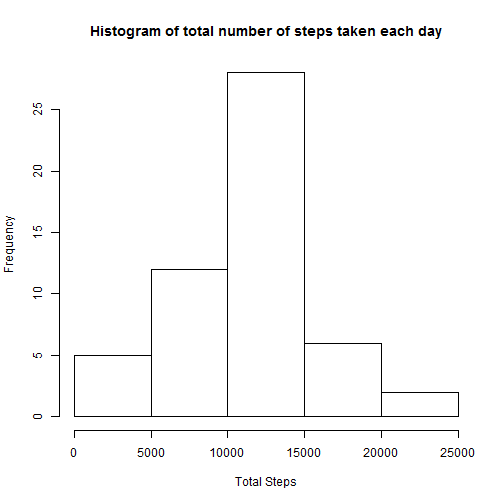
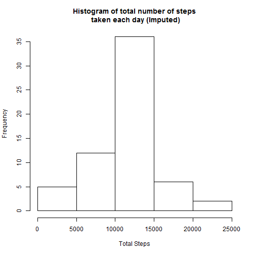
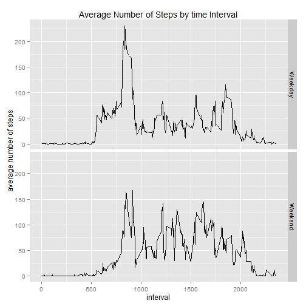

Load and preprocess the data

```r
activity = read.csv(file='./data/activity.csv', header = TRUE)
activity$date <- as.Date(activity$date,format='%Y-%m-%d')
```


# 1 Total number of steps taken per day

```r
library(sqldf)
library(ggplot2)
tepsPerDay <- sqldf( 'select Date, sum(steps) as totalSteps 
                      from activity 
                      where steps is not null 
                      group by date')
```


#Create a Histogram of total number of steps taken each day, then calculate mean and median of total steps taken

```r
#png("Plot1.png")
hist(stepsPerDay$totalSteps, main = 'Histogram of total number of steps taken each day', xlab = 'Total Steps')
```

 

```r
mean(stepsPerDay$totalSteps)
```

```
## [1] 10766.19
```

```r
median(stepsPerDay$totalSteps)
```

```
## [1] 10765
```

```r
#dev.off()
```

# Create and Plot a Time Series: Average number of steps by time interval across all days

```r
png("Plot2.png")
timeSeries <- sqldf('select interval, avg(steps) as averageSteps 
                    from activity
                    where steps is not null
                    group by interval')

# Plot Time Series 
g <- ggplot(data=timeSeries, aes(x=interval, y=as.numeric(averageSteps))) 
g <- g + ylab('average number of steps')                       # label y axis
g <- g + geom_line()                                           # use line graph (type=l)
g <- g + ggtitle("Average Number of Steps by time Interval")
print(g)
#dev.off()
```

# maximum number of steps observed for a given interval

```r
maxSteps <- sqldf('select max(averageSteps) from timeSeries')
maxSteps <- as.numeric(maxSteps)
```

#interval with the maximum number of days

```r
intervalWithMaxSteps <- sqldf('select interval
                              from timeSeries
                              where averageSteps = (select max(averageSteps) from timeSeries)')

intervalWithMaxSteps <- unlist(intervalWithMaxSteps)
```


# Imputing missing values

seperate missing valued rows from rows with values


```r
presentValues <- activity[!is.na(activity$steps),]
missingValues <- activity[ is.na(activity$steps),]
```

Total number of missing days

```r
missingValuesCount <- nrow(missingValues)
```

replace missing steps with average steps for that interval by joining missingValues with the timeSeries generated above

```r
mergedValues <- merge(x=missingValues, y=timeSeries, by="interval")

#rearrange and rename columns accordingly
imputedValues <- mergedValues[,c("averageSteps","date","interval")]
names(imputedValues) <- names(presentValues)

#create new dataset 
activityImputed <- rbind(presentValues,imputedValues)
```


# Create histogram using imputed data

```r
stepsPerDayImputed <- sqldf('select Date, sum(steps) as totalSteps
                            from activityImputed
                            where steps is not null 
                            group by date')
#png("Plot3.png")
hist(stepsPerDayImputed$totalSteps, main = 'Histogram of total number of steps\n taken each day (Imputed)', xlab = 'Total Steps')
```

 

```r
mean(stepsPerDayImputed$totalSteps)
```

```
## [1] 10766.19
```

```r
median(stepsPerDayImputed$totalSteps)
```

```
## [1] 10766.19
```

```r
#dev.off()
```

#Create new columm identifying weekends and weekdays

```r
activityImputed$dayType <- ifelse(weekdays(activityImputed$date, abbreviate = T) %in% c("Sun","Sat"), "Weekend", "Weekday")
activityImputed$dayType <- as.factor(activityImputed$dayType)
```

# Time Series2: Average number of steps by time interval across all days


```r
#png("Plot4.png")
timeSeriesImputed <- sqldf('select interval, dayType, avg(steps) as averageSteps 
                            from activityImputed
                            group by interval, dayType')
```

# Plot 2nd Time Series, this time with day type included 

```r
h <- ggplot(data=timeSeriesImputed, aes(x=interval, y=as.numeric(averageSteps))) 
h <- h + ylab('average number of steps')                       # label y axis
h <- h + geom_line()                                           # use line graph (type=l)
h <- h + ggtitle("Average Number of Steps by time Interval")
h <- h + facet_grid(dayType ~.)
print(h)
```

 

